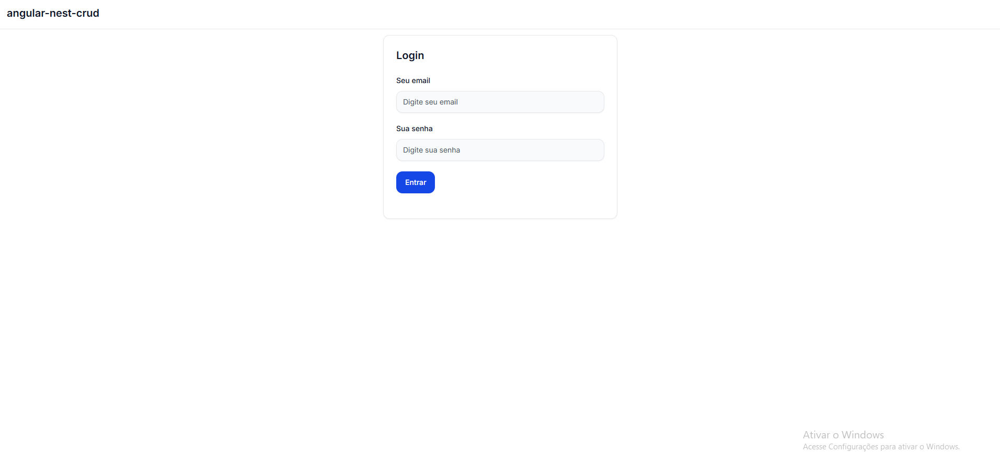
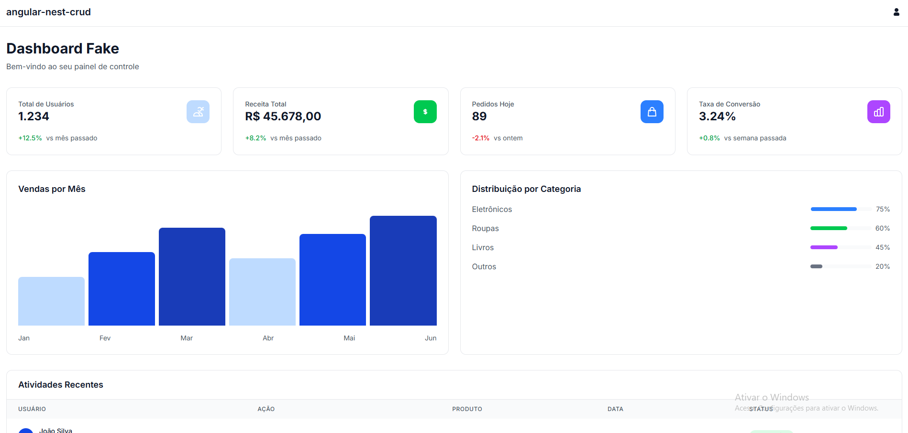

# Projeto Full Stack - Angular + NestJS

Sistema full stack simples desenvolvido com **Angular** no frontend e **NestJS** no backend.  
A aplicação possui autenticação de usuários com **JWT**, fluxo de **login e registro**, integração com banco de dados **MySQL** e acesso a um **dashboard protegido**.

---

# Preview

## Tela de Login


## Dashboard


---

# Tecnologias Utilizadas

## Frontend (`client`)

- Angular Standalone Components
- TailwindCSS
- Flowbite
- TypeScript
- RxJS

## Backend (`server`)

- NestJS
- TypeORM
- Swagger
- JWT Authentication
- MySQL
- Migrations

---

# Funcionalidades

- Registro de usuários
- Login autenticado com JWT
- Token JWT expirável
- Senhas com encriptação bcrypt
- Rotas protegidas
- Dashboard fake
- Persistência de dados com MySQL
- Migrations com TypeORM
- Documentação da API com Swagger
- Estrutura modular no backend
- Interface responsiva com TailwindCSS + Flowbite
- Angular utilizando arquitetura Standalone Components

---

# Banco de Dados

O projeto utiliza:

- MySQL
- TypeORM
- Migrations

Configure as variáveis de ambiente no arquivo:

```bash
server/.env
```

Exemplo:

```env
PORT=3001
CORS='*'

DB_HOST='localhost'
DB_PORT=3306
DB_USER='root' 
DB_PASS='password' 
DB_DATABASE='db_nest_crud'

JWT_SECRET=seu_secret
JWT_EXPIRATION=3600000

DOCS_TITLE=API NestJS CRUD
DOCS_DESCRIPTION=API com autenticação JWT, CRUD de usuários e entidades
DOCS_VERSION=1.0.0
DOCS_CONTACT_NAME=Suporte API
DOCS_CONTACT_URL=https://seu-site.com
DOCS_CONTACT_MAIL=suporte@seu-site.com
```

---

# Executando Migrations

Dentro da pasta `server`:

```bash
npm run migration:run
```

---

# Autenticação JWT

A autenticação foi implementada utilizando:

- Access Token JWT
- Expiração de token
- Guards no NestJS
- Rotas privadas

---

# Arquitetura Frontend

O frontend foi desenvolvido utilizando o **Angular Standalone Components**, uma abordagem moderna do Angular que elimina a necessidade de módulos tradicionais (`NgModules`), deixando a aplicação mais simples, escalável e performática.

Principais vantagens:

- Melhor organização de componentes
- Estrutura mais moderna
- Menos boilerplate
- Carregamento otimizado
- Melhor experiência de desenvolvimento

---

# Documentação da API

A documentação da API foi criada utilizando Swagger.

Após iniciar o backend, acesse:

```bash
http://localhost:3000/api
```

---

# Testando a API

Você pode testar os endpoints diretamente pelo Swagger:

- Registro de usuário
- Login
- Rotas autenticadas

---

# Principais Conceitos Aplicados

- Arquitetura Full Stack
- Autenticação Stateless
- JWT Authentication
- Modularização com NestJS
- Integração Frontend + Backend
- Angular Standalone Components
- Responsividade com TailwindCSS
- ORM com TypeORM
- Migrations
- Documentação de API

